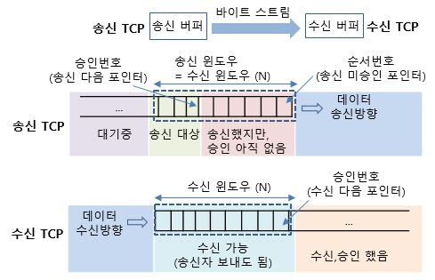
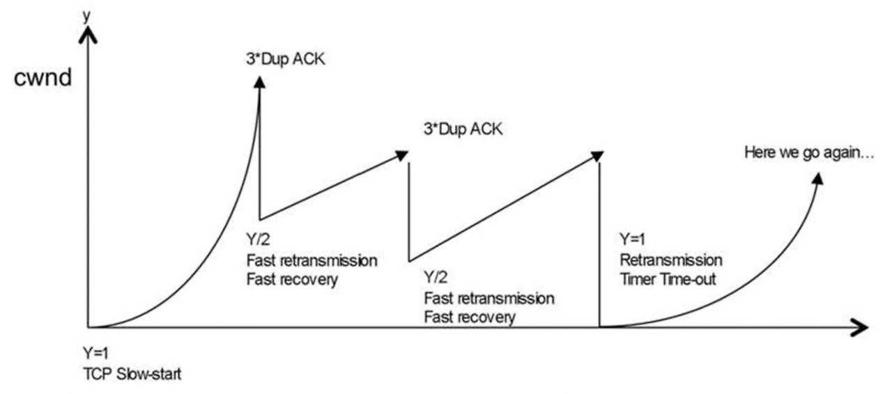

## TCP 오류제어

TCP에서는 오류를 발견하는 기준이 크게 2가지 있다.

- 반복되는 ACK 신호를 받을 때

    - 이는 ACK에 담긴 받기를 원하는 순서번호를 못받을 경우 같은 ACK를 보내도록 되어있기에 발생한다. (흔히 찡찡대기)

- 송신한 세그먼트가 타임아웃이 발생했을 때

    - 모든 송신된 세그먼트는 `재전송 타이머`를 실행하고, 재전송 타이머가 지났는데도 ACK 세그먼트를 받지 못한다면 `타임 아웃`을 인지하여 같은 세그먼트를 재전송한다.

그래서 ARQ(Automatic Repeat Request) 라는 재전송 기법을 사용한다.

- 여담이지만 TCP만이 ARQ를 사용하진 않는다는것

ARQ에는 `Stop-and-Wait`, `Go-Back-N`, `Selective Repeat` 기법이 있다.

- **`Stop-and-Wait`**

    - 이름에서 알 수 있듯, 만약 송신자의 세그먼트에 대한 ACK 세그먼트를 받지 못했다면 (즉, 패킷 손실이 발생) 마지막 송신자 세그먼트의 재전송 타이머가 끝나 타임아웃이 될 때까지 상대측도 기다렸다가 재전송되고 나서 재게한다.

    - 이는 하나를 보내고 그에대한 ACK가 오고서 그 다음것을 보내는 특징이 강력하고, 결국 상대측도 보낼 수 있는 상태지만 `Stop-and-Wait` 때문에 아무것도 못하게 되어 비효율적인 네트워크 사용이 된다.

- **`Go-Back-N`**

    - 기본적으로 위의 "하나 주고 ACK 받으면 그다음거 주고~" 하는 방식이 너무 비효율적임을 확인하여, 일정 개수만큼 (정확하게는 윈도우 크기만큼) ACK를 받지않더라도 보내는 방식인 `파이프라이닝` 기법을 도입

    - 쭉 보내다가 ACK 세그먼트를 받지 못한것이 존재하면, 해당 수신넘버 이후의 세그먼트를 이미 주었다 하더라도 수신측에서 폐기함

        - n, n+1, n+2, n+3을 송신측에서 파이프라이닝으로 보낸다 했을 때, n+1까지는 ACK를 받았고 n+2는 손실되고 n+3은 도착하였을 때를 생각해보면

        - 수신측 입장에서는 사실 마지막 ACK를 보내는건 n+2를 원한다는 ACK였을 것이며 n+3이 왔으니 자연스럽게 폐기됨

    - 그래서 ACK를 받지못한 세그먼트가 타임아웃 되었을 때, 그 순서넘버 부터 다시 보내는것이 가장 큰 특징

        - 결국 위의 예시처럼 잘 보내졌던 n+3, ..., n+k가 있다 하더라도 다 폐기되어버리므로 이것이 비효율적임

- **`Selective Repeat`**

    - 위의 파이프라이닝 기반에서 돌아가는 오류제어 기법으로 말뜻 그대로 선택적으로 재전송하는것을 뜻함

        - 즉, ACK없이 보내는 여러 세그먼트중에서 ACK를 진짜 받지못한녀석만 재전송 되어 처리됨

    - 연결 수립할 때, 송 수신측이 서로 TCP 헤더에 Option필드에 SACK필드가 켜져있는지 확인되면 해당 ARQ를 사용하고 아니면 `Go-Back-N`로 작동한다고 함

오늘날 대부분의 TCP 통신에서는 `Selective Repeat`가 사용된다고 한다.

## TCP 흐름제어

흐름제어는 물론 `Stop-and-Wait`에는 적용되는 말은 아닐것이다.

ACK없이 일정 양만큼 보낼 수 있는 `Go-Back-N`과 `Selectvie Repeat`에 한해서 필요한 제어이다.

왜냐하면 아무리 ACK 안받고도 계속 밀어넣을 수 있다지만, 무한정 넣으면 안되기 때문이다.

기본적으로 TCP 연결으로 통신하면 둘다 `수신버퍼`와 `송신버퍼`를 갖게 되고, 이들 버퍼보다 더 큰 양을 보내면 당연히 `버퍼오버플로`가 발생할 것이다.

그래서 파이프라이닝에서 각각의 호스트는 `윈도우`라는 `ACK`없이 보낼 수 있는 크기를 지정하고 `슬라이딩 윈도우`기법으로 세그먼트를 하나씩 전송하게 된다.

`TCP 세그먼트의 윈도우 필드`를 사용하여 수신측에서 받을 수 있는 `윈도우`의 크기를 송신측에게 알려줄 수 있다.

그리고 `슬라이딩 윈도우`처럼 통해 수신측에서 ACK를 보낼때 윈도우를 하나씩 밀게 된다.

결론: 윈도우 기법은 수신측의 처리속도에 맞춘 흐름제어 기법이다.

<figure>
    
    
출처: http://www.ktword.co.kr/test/view/view.php?no=1469

</figure>

## TCP 혼잡 제어

혼잡제어는 위에서 확인한 윈도우와 관련 있으며, 너무많은 송신측의 세그먼트로 인해 수신측 입장에서 과부하가 걸리지 않도록 제어하는 것을 의미한다.

`혼잡 윈도우`란 혼잡없이 전송가능한 윈도우의 크기를 의미한다.

- 혼잡 윈도우가 크는것은 그만큼 수신측에서 현재 널널하다는것

- 혼잡 윈도우가 작다는것은 그만큼 수신측이 현재 처리할 양이 많다는 것

이러한 `혼잡 윈도우`의 크기는 수신측에서 보내는 세그먼트의 윈도우 필드로 확인 가능한것이 아니라

송신측에서 직접 계산을하여 `현재 혼잡 윈도우를 이만큼으로 잡아야 하는구나` 라고 계산해야 한다.

`AIMD(Additive Increase/Multiplicative Decrease)`는 혼잡제어에 사용되는 가장 기본적인 알고리즘으로서

혼잡이 감지되면 혼잡 윈도우의 크기를 절반으로 감소시키고, 혼잡이 감지되지 않는다면 RTT마다 1씩 증가하는 것

이를 기반으로 한 알고리즘 중 `느린시작(slow start)`이 있다.

`느린시작`은 혼잡 윈도우의 크기를 말그대로 처음엔 1로 시작하였다 RTT마다 2배씩 증가시키고, 

해당 크기가 함께 설정한  `느린 시작 임계치`에 도달하거나 타임아웃에 도달할 경우 추가 알고리즘을 수행한다.

- `타임아웃`: 다시 혼잡윈도우를 1부터 시작하고 느린 시작 임계치를 타임아웃이 발생한 혼잡윈도우 크기의 절반으로 설정후 `느린시작` 수행

- `현재 혼잡윈도우가 느린 시작 임계치를 넘어선 경우`: 느린 시작을 종료하고 혼잡 윈도우를 절반으로 줄인뒤 `혼잡 회피 알고리즘` 수행

    - `혼잡 회피 알고리즘`: RTT마다 혼잡 윈도우의 크기를 1MSS 씩 증가시키는 알고리즘
        
        - 혼잡 회피 수행도중 타임아웃 발생시 -> `느린시작`

        - 혼잡 회피 수행도중 세번의 중복 ACK -> `혼잡제어 윈도우와 임계치를 절반으로 떨어트린 후 빠른회복 수행`

- `세번의 중복 ACK 발생`: `빠른회복 알고리즘` 수행

    - `빠른 회복 알고리즘`: 기존의 타임아웃 이전 중복 ACK를 3회 받으면 빠른 재전송과 동시에 수행되는 알고리즘으로 `느린 시작`과정 없이 바로 `혼잡 회피 알고리즘`으로 수행한다.

        - 빠른 회복 수행도중 타임아웃 발생시 -> `느린시작`

        <figure>
            
            
출처: https://eunhyee.tistory.com/249

        </figure>

